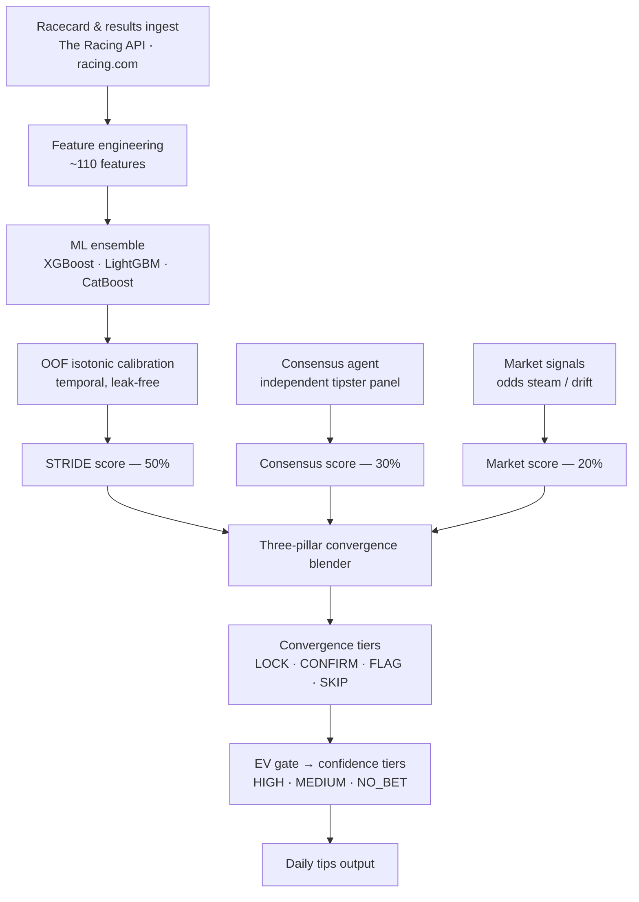

# STRIDE — Horse Racing Prediction Pipeline

A machine-learning pipeline for Australian thoroughbred racing that predicts
win probabilities, calibrates them against the betting market, and surfaces
**positive expected-value** wagers.

> **This repository is published for review, not deployment.** It contains the
> Python ML pipeline only. Trained models, datasets, the database, and the
> web frontend are intentionally excluded — so the code is **read-only and not
> runnable end-to-end**. See [LICENSE](LICENSE): all rights reserved.

---

## What this demonstrates

This is a production-style ML system, not a notebook. It shows:

- **Ensemble modelling** — gradient-boosted trees (XGBoost · LightGBM ·
  CatBoost) combined into a single win-probability estimate.
- **Temporal-safe calibration** — out-of-fold isotonic calibration over 30k+
  strictly time-ordered predictions, with calibration leakage explicitly
  removed. Probabilities are honest, not overstated.
- **Feature engineering at scale** — ~110 engineered features (form, pace,
  sectionals, trainer/jockey patterns, barrier-trial signals, fitness cycles).
- **A multi-source intelligence layer** — model output is fused with an
  independent tipster consensus and live market-movement signals.
- **Orchestration & guardrails** — a multi-stage daily pipeline with freshness
  checks, hard gates, and an automated scheduler.

## Methodology — value, not tips

The system bets on a market edge, not on picking winners:

```
edge            = true_win_probability − fair_market_probability
expected_value  = (calibrated_prob / fair_market_prob) − 1
```

A selection is only actionable when `edge > 0`. Expected value is the primary
ranking signal. Three pillars converge on every runner:

| Pillar | Weight | Source |
|--------|--------|--------|
| STRIDE model | 50% | Calibrated ML ensemble |
| Consensus | 30% | Independent tipster panel |
| Market signal | 20% | Odds steam / drift detection |

Convergence is graded into tiers (`LOCK`, `CONFIRM`, `FLAG`, `CROWD_OVERRIDE`,
`SKIP`); an EV gate then assigns a confidence tier (`HIGH`, `MEDIUM`, `NO_BET`).

## Architecture



## Daily pipeline

1. **Ingest** — download racecards and prior results.
2. **Build intelligence** — feature engineering, form franking, pace/speed maps.
3. **Consensus** — poll an independent tipster panel for crowd signal.
4. **Market signals** — capture odds snapshots and classify steam/drift.
5. **Predict & converge** — ensemble inference, three-pillar blending, gating.
6. **Publish** — stamp the final selection contract for downstream display.

## Model snapshot

| Metric | Value |
|--------|-------|
| Algorithm | XGBoost + LightGBM + CatBoost ensemble |
| Features | ~110 engineered features |
| Calibration | Out-of-fold isotonic — 27 folds, 30,226 temporal predictions |
| Cross-validated AUC | ≈ 0.80 |

## Tech stack

Python · scikit-learn · XGBoost · LightGBM · CatBoost · NumPy / pandas ·
PostgreSQL (Neon) · Monte Carlo simulation.

## Repository layout

```
server/python/              Core pipeline — ingestion, features, modelling,
                            consensus, market signals, convergence, scheduler
build_features.py           Feature engineering entry point
monte_carlo.py              Monte Carlo race simulation
racing_system_v8.3_mc.py    Standalone racing/simulation system
download_training_data.py   Training-data assembly
migrations/                 PostgreSQL schema
requirements.txt            Python dependencies
.env.example                Required environment variables (template)
server/python/tipster_panel.example.json
                            Tipster consensus panel (template)
```

## Configuration

Runtime configuration is environment-driven — no secrets in source. Copy
[`.env.example`](.env.example) to `.env` and supply your own credentials
(database URL and API keys). The `.env` file is git-ignored.

The tipster consensus panel is templated the same way. Copy
[`server/python/tipster_panel.example.json`](server/python/tipster_panel.example.json)
to `server/python/tipster_panel.json` and populate it with your own independent
tipster sources. The real `tipster_panel.json` is git-ignored.

## License

Proprietary — © 2026 Sage Abdallah. All rights reserved. The code is visible
for reference only; reuse, copying, or modification is not permitted. See
[LICENSE](LICENSE).
