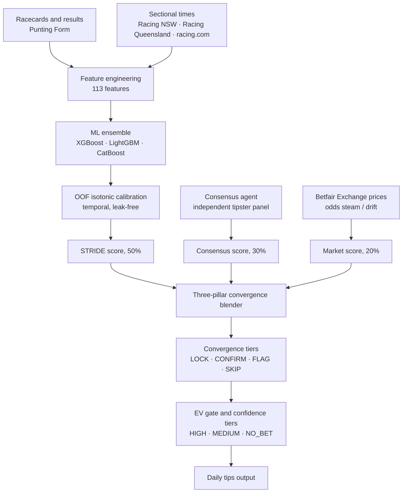

# STRIDE: Horse Racing Prediction Pipeline

A machine learning pipeline for Australian thoroughbred racing that predicts
win probabilities, calibrates them against the betting market, and surfaces
**positive expected-value** wagers.

> **This repository is published for review, not deployment.** It contains
> the Python pipeline, the AWS deployment scripts and the GitHub Actions that
> run and watch it. Trained models, datasets, the database, the tipster panel
> and the web frontend are intentionally excluded, so the code is
> **read-only and not runnable end to end**. See [LICENSE](LICENSE): all
> rights reserved.

---

## What this demonstrates

This is a production system that runs by itself every day, not a notebook.
It shows:

- **Ensemble modelling.** Gradient-boosted trees (XGBoost · LightGBM ·
  CatBoost) combined into a single win-probability estimate.
- **Temporal-safe calibration.** Out-of-fold isotonic calibration over 30k+
  strictly time-ordered predictions, with calibration leakage explicitly
  removed. Probabilities are honest, not overstated.
- **Feature engineering at scale.** 113 engineered features (form, pace,
  sectionals, trainer/jockey patterns, barrier-trial signals, fitness cycles).
- **A multi-source intelligence layer.** Model output is fused with an
  independent tipster consensus and live market-movement signals.
- **Orchestration and guardrails.** A daily chain of jobs on AWS with
  freshness checks and hard gates, plus GitHub Actions that watch every run
  and open an issue with the log when something fails or does not run at all.

## Documentation

Deep documentation of how everything works lives in [`docs/`](docs/README.md):

| | |
|---|---|
| [Architecture](docs/01-architecture.md) · [Daily pipeline](docs/02-daily-pipeline.md) | the big picture and a race day end to end |
| [Data & ingestion](docs/03-data-and-ingestion.md) · [Feature engineering](docs/04-feature-engineering.md) | sources, collectors, DB schema, the feature contract |
| [ML training & calibration](docs/05-ml-training-and-calibration.md) · [Monte Carlo engine](docs/06-monte-carlo-engine.md) | the two probability engines |
| [Intelligence layer](docs/07-intelligence-layer.md) · [Consensus & market](docs/08-consensus-and-market.md) | form franking, tipster panel, market signals |
| [Scoring & output](docs/09-scoring-and-output.md) · [Backtesting & learning](docs/10-backtesting-and-learning.md) | the BET/NO_BET contract and the evaluation loop |
| [Module reference](docs/11-module-reference.md) | one-line purpose for every file |
| [Hit-rate research & roadmap](docs/12-hit-rate-research.md) | research-backed improvements and how to validate them |

How it is deployed and run is in [`infra/README.md`](infra/README.md) and
[`docs/DEPLOY_RUNBOOK.md`](docs/DEPLOY_RUNBOOK.md).

## Methodology: value, not tips

The system bets on a market edge, not on picking winners:

```
edge            = true_win_probability − fair_market_probability
expected_value  = (calibrated_prob / fair_market_prob) − 1
```

A selection is only actionable when `edge > 0`. Expected value is the primary
ranking signal. Three pillars converge on every runner:

| Pillar | Weight | Source |
|--------|--------|--------|
| STRIDE model | 50% | Calibrated ML ensemble |
| Consensus | 30% | Independent tipster panel |
| Market signal | 20% | Odds steam / drift detection |

Convergence is graded into tiers (`LOCK`, `CONFIRM`, `FLAG`, `CROWD_OVERRIDE`,
`SKIP`); an EV gate then assigns a confidence tier (`HIGH`, `MEDIUM`, `NO_BET`).

## Architecture



Racecards and results come from Punting Form, which replaced The Racing API
in July 2026 after that service stopped covering Australian racing. Prices
come from the Betfair Exchange. Sectional times come from Racing NSW, Racing
Queensland and racing.com. The switch is written up in
[`PUNTINGFORM_MIGRATION.md`](PUNTINGFORM_MIGRATION.md).

## Daily pipeline

Everything runs on AWS on a Sydney-time schedule.

1. **Ingest (04:00).** Download the day's racecards from Punting Form and
   seed the race schedule. Results and sectionals are collected each night
   at 22:30.
2. **Build intelligence (04:15 to 04:20).** A first Betfair price snapshot,
   then feature engineering, form franking, pace and speed maps.
3. **Consensus (05:30).** Poll the independent tipster panel for crowd signal.
4. **Market signals (07:30).** Capture Betfair prices and classify steam and
   drift against the early snapshot.
5. **Predict and converge (08:05).** Ensemble and Monte Carlo inference,
   three-pillar blending, gating.
6. **Publish.** Write the day's tips file and the `selections` rows the
   frontend displays. Prices are then tracked up to each jump and the ledger
   is settled against Betfair starting prices.

About a third of days have no racing at the target tracks. On those days the
racecard job records a quiet day and the rest of the chain stands down.

## How it runs

- **Deployment.** [`infra/`](infra/) holds the AWS setup as shell scripts:
  one container image shared by every job, four Lambdas, ten Fargate tasks,
  their schedules, secrets and alerts. The `deploy-infra` workflow runs them
  from GitHub Actions with no stored AWS keys. Models and the tipster panel
  live in a private bucket and are loaded when a task starts.
- **Watching.** GitHub Actions check that every scheduled job ran, report
  any failed task with the tail of its log, and confirm the morning actually
  produced tips. Each opens an issue and a read-only agent comments a
  diagnosis. A failed task also sends an email.
- **Backups and probes.** The racecard and results ingestion also runs on
  GitHub-hosted runners as a second path. Other workflows audit the
  schedules, probe each data provider, and run training or backfills on
  demand. There are 34 in [`.github/workflows/`](.github/workflows/), each
  explained at the top of its file.

## Model snapshot

| Metric | Value |
|--------|-------|
| Algorithm | XGBoost + LightGBM + CatBoost ensemble |
| Features | 113 engineered features |
| Calibration | Out-of-fold isotonic, 27 folds, 30,226 temporal predictions |
| Cross-validated AUC | ≈ 0.80 |

## Results: 4 March to 18 April 2026

The post-calibration-fix model was walked through metro races from
2026-03-04 to 2026-04-18: 352 races, 3,396 runners, flat $100 stake at
starting prices. This is the last completed evaluation window. The pipeline
was restarted on AWS in August 2026 and a new window is being collected
under rules written down in advance (see
[`docs/roi-roadmap/09-forward-validation-protocol.md`](docs/roi-roadmap/09-forward-validation-protocol.md)
and [`docs/validation/`](docs/validation/)). This section will be replaced
when that window closes.

### ROI by selection band

Net ROI is after 8% commission on winnings (NSW/ACT tote is 10%; both rates
are in the JSON). CI is the 95% bootstrap interval on net ROI (10k resamples,
resampling bets). A band is REPORTABLE only when its CI excludes zero **and**
it has at least 200 bets.

| Strategy | Bets | Strike rate | P&L | ROI (gross) | ROI (net 8%) | 95% CI (net) | Status |
|---|---:|---:|---:|---:|---:|---:|---|
| Value Edge ≥ 3% ($2 to $15) | 142 | 9.9% | +$1,750 | +12.3% | +4.1% | [−45.1, +61.9]% | **NOT_REPORTABLE** |
| Top Pick (highest prob) | 344 | 33.7% | −$1,445 | −4.2% | −9.2% | [−23.4, +5.6]% | NOT_REPORTABLE |
| All $2 to $20, positive edge | 333 | 7.5% | −$1,800 | −5.4% | −12.4% | [−45.6, +23.5]% | NOT_REPORTABLE |
| Big Value $5 to $15, ≥ 5% edge | 54 | 7.4% | −$800 | −14.8% | −21.0% | [−87.9, +64.7]% | NOT_REPORTABLE |
| Mid-Range $3 to $8, ≥ 5% edge | 25 | 12.0% | −$700 | −28.0% | −32.8% | [−100.0, +49.4]% | NOT_REPORTABLE |
| Short Price $2 to $5, ≥ 3% edge | 7 | 0.0% | −$700 | −100.0% | −100.0% | [−100.0, −100.0]% | NOT_REPORTABLE |

The old headline, Value Edge ≥ 3% at +12.3% gross, does **not** survive
scrutiny, and this table says so instead of hiding it:

- Its 95% CI spans zero ([−45.1, +61.9]%); z = 0.15, bootstrap P(ROI ≤ 0) ≈ 46%.
- It is the best of 6 bands tried on one window: Bonferroni requires z ≥ 2.64.
- At 8% commission the +12.3% gross is +4.1% net (10%: +2.1%). Two-thirds
  to five-sixths of the apparent edge is commission.
- Remove its single best winner and the band is at −5.0% (two: −13.6%).
  The "edge" is one or two horses.
- Its 142-bet path includes a max losing streak of 30 and a 46.7-unit
  drawdown. A real bankroll would have had to live through that.

No band is reportable on this window. Top Pick lands 33.7% of the time but
at favourite prices (−9.2% net). The value-versus-accuracy tradeoff the
convergence layer navigates is real; a statistically validated edge on this
sample is not.

### Calibration


| Predicted bin | Runners | Predicted mean | Observed mean |
|---|---:|---:|---:|
| 0.00 to 0.10 | 1,786 | 0.053 | 0.029 |
| 0.10 to 0.20 | 1,337 | 0.144 | 0.151 |
| 0.20 to 0.30 | 265 | 0.231 | 0.328 |
| 0.30 to 0.40 | 6 | 0.318 | 0.500 |
| 0.40 to 0.50 | 2 | 0.434 | 0.000 |

Brier score **0.0834** across 3,396 runners. Calibration is tight through
the bulk of the prediction distribution (the 0.10 to 0.20 bin is almost
perfectly aligned); the 0.20 to 0.30 band is slightly *under*-predicted, so
high-confidence picks win more often than the calibrated probability suggests.

Raw summary: [`examples/backtest_summary.json`](examples/backtest_summary.json).

### Sample race-day output

What the live pipeline produces, from the last day of that window,
2026-04-18:

- [`examples/sample_selections.json`](examples/sample_selections.json): best bets, value plays, convergence summary
- [`examples/sample_race.json`](examples/sample_race.json): one full race (Morphettville Parks R5, 9 runners) with model scores, edges and the AI form analysis for every runner

## Tech stack

Python 3.11 · scikit-learn · XGBoost · LightGBM · CatBoost · NumPy / pandas ·
PostgreSQL (Neon) · Monte Carlo simulation · AWS (ECS Fargate, Lambda,
EventBridge Scheduler, S3, DynamoDB, Secrets Manager, SNS) · GitHub Actions.

## Repository layout

```
server/python/              Core pipeline: ingestion, features, modelling,
                            consensus, market signals, convergence, tests
server/python/providers/    Racing data adapters (Punting Form is live)
infra/                      AWS setup as shell scripts, the Dockerfile and
                            the job handler every task runs
.github/workflows/          34 workflows: CI, deploy, ingestion, watchers,
                            audits, probes, training, backfills
docs/                       The reference documents, deploy runbook, the
                            decision-learning plan, ROI
                            roadmap, validation records and research notes
migrations/                 PostgreSQL schema
examples/                   Sample race-day output and the backtest summary
scripts/                    Provider probes, Betfair key checks, calibration plot
monte_carlo.py              Monte Carlo race simulation
racing_system_v8.3_mc.py    Standalone racing/simulation system
requirements.txt            Python dependencies (pyproject.toml and uv.lock mirror it)
.env.example                Required environment variables (template)
server/python/tipster_panel.example.json
                            Tipster consensus panel (template)
```

The plan for the decision-learning layer and its progress tracker are the
numbered files in
[`docs/decision-learning/`](docs/decision-learning/README.md). `CLAUDE.md` and
[`docs/roi-roadmap/AGENTS.md`](docs/roi-roadmap/AGENTS.md) are the working
rules for the coding agents that help maintain the repo.

## Configuration

Runtime configuration is environment-driven, with no secrets in source. Copy
[`.env.example`](.env.example) to `.env` and supply your own credentials
(database URL, Punting Form key, Betfair app key and certificate, LLM keys).
The `.env` file is git-ignored. In production the same values live in AWS
Secrets Manager and are written there from the repository's GitHub secrets
by the `deploy-infra` workflow.

The tipster consensus panel is templated the same way. Copy
[`server/python/tipster_panel.example.json`](server/python/tipster_panel.example.json)
to `server/python/tipster_panel.json` and populate it with your own independent
tipster sources. The real `tipster_panel.json` is git-ignored.

## License

Proprietary. © 2026 Sage Abdallah. All rights reserved. The code is visible
for reference only; reuse, copying, or modification is not permitted. See
[LICENSE](LICENSE).
