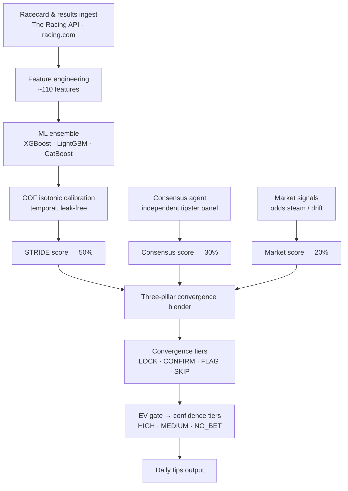
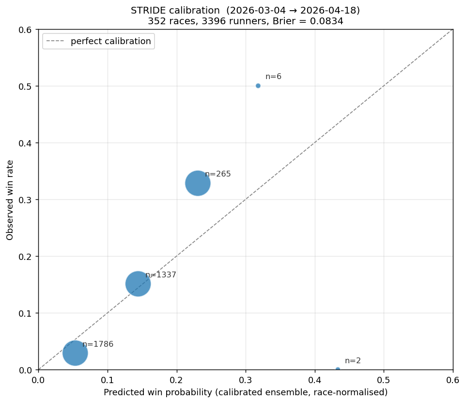

# STRIDE — Horse Racing Prediction Pipeline

A machine-learning pipeline for Australian thoroughbred racing that predicts
win probabilities, calibrates them against the betting market, and surfaces
**positive expected-value** wagers.

> **This repository is published for review, not deployment.** It contains the
> Python ML pipeline only. Trained models, datasets, the database, and the
> web frontend are intentionally excluded — so the code is **read-only and not
> runnable end-to-end**. See [LICENSE](LICENSE): all rights reserved.

---

## What this demonstrates

This is a production-style ML system, not a notebook. It shows:

- **Ensemble modelling** — gradient-boosted trees (XGBoost · LightGBM ·
  CatBoost) combined into a single win-probability estimate.
- **Temporal-safe calibration** — out-of-fold isotonic calibration over 30k+
  strictly time-ordered predictions, with calibration leakage explicitly
  removed. Probabilities are honest, not overstated.
- **Feature engineering at scale** — ~110 engineered features (form, pace,
  sectionals, trainer/jockey patterns, barrier-trial signals, fitness cycles).
- **A multi-source intelligence layer** — model output is fused with an
  independent tipster consensus and live market-movement signals.
- **Orchestration & guardrails** — a multi-stage daily pipeline with freshness
  checks, hard gates, and an automated scheduler.

## Documentation

Deep documentation of how everything works lives in [`docs/`](docs/README.md):

| | |
|---|---|
| [Architecture](docs/01-architecture.md) · [Daily pipeline](docs/02-daily-pipeline.md) | the big picture and a race day end to end |
| [Data & ingestion](docs/03-data-and-ingestion.md) · [Feature engineering](docs/04-feature-engineering.md) | sources, collectors, DB schema, the 110-feature contract |
| [ML training & calibration](docs/05-ml-training-and-calibration.md) · [Monte Carlo engine](docs/06-monte-carlo-engine.md) | the two probability engines |
| [Intelligence layer](docs/07-intelligence-layer.md) · [Consensus & market](docs/08-consensus-and-market.md) | form franking, tipster panel, market signals |
| [Scoring & output](docs/09-scoring-and-output.md) · [Backtesting & learning](docs/10-backtesting-and-learning.md) | the BET/NO_BET contract and the evaluation loop |
| [Module reference](docs/11-module-reference.md) | one-line purpose for every file |
| [Hit-rate research & roadmap](docs/12-hit-rate-research.md) | research-backed improvements and how to validate them |

## Methodology — value, not tips

The system bets on a market edge, not on picking winners:

```
edge            = true_win_probability − fair_market_probability
expected_value  = (calibrated_prob / fair_market_prob) − 1
```

A selection is only actionable when `edge > 0`. Expected value is the primary
ranking signal. Three pillars converge on every runner:

| Pillar | Weight | Source |
|--------|--------|--------|
| STRIDE model | 50% | Calibrated ML ensemble |
| Consensus | 30% | Independent tipster panel |
| Market signal | 20% | Odds steam / drift detection |

Convergence is graded into tiers (`LOCK`, `CONFIRM`, `FLAG`, `CROWD_OVERRIDE`,
`SKIP`); an EV gate then assigns a confidence tier (`HIGH`, `MEDIUM`, `NO_BET`).

## Architecture



## Daily pipeline

1. **Ingest** — download racecards and prior results.
2. **Build intelligence** — feature engineering, form franking, pace/speed maps.
3. **Consensus** — poll an independent tipster panel for crowd signal.
4. **Market signals** — capture odds snapshots and classify steam/drift.
5. **Predict & converge** — ensemble inference, three-pillar blending, gating.
6. **Publish** — stamp the final selection contract for downstream display.

## Model snapshot

| Metric | Value |
|--------|-------|
| Algorithm | XGBoost + LightGBM + CatBoost ensemble |
| Features | ~110 engineered features |
| Calibration | Out-of-fold isotonic — 27 folds, 30,226 temporal predictions |
| Cross-validated AUC | ≈ 0.80 |

## Recent results

Live (post-calibration-fix) model walked through metro races
**2026-03-04 → 2026-04-18** — 352 races, 3,396 runners, flat $100 stake at
starting prices.

### ROI by selection band

Net ROI is after 8% commission on winnings (NSW/ACT tote is 10% — both rates
are in the JSON). CI is the 95% bootstrap interval on net ROI (10k resamples,
resampling bets). A band is REPORTABLE only when its CI excludes zero **and**
it has ≥ 200 bets.

| Strategy | Bets | Strike rate | P&L | ROI (gross) | ROI (net 8%) | 95% CI (net) | Status |
|---|---:|---:|---:|---:|---:|---:|---|
| Value Edge ≥ 3% ($2–$15) | 142 | 9.9% | +$1,750 | +12.3% | +4.1% | [−45.1, +61.9]% | **NOT_REPORTABLE** |
| Top Pick (highest prob) | 344 | 33.7% | −$1,445 | −4.2% | −9.2% | [−23.4, +5.6]% | NOT_REPORTABLE |
| All $2–$20, positive edge | 333 | 7.5% | −$1,800 | −5.4% | −12.4% | [−45.6, +23.5]% | NOT_REPORTABLE |
| Big Value $5–$15, ≥ 5% edge | 54 | 7.4% | −$800 | −14.8% | −21.0% | [−87.9, +64.7]% | NOT_REPORTABLE |
| Mid-Range $3–$8, ≥ 5% edge | 25 | 12.0% | −$700 | −28.0% | −32.8% | [−100.0, +49.4]% | NOT_REPORTABLE |
| Short Price $2–$5, ≥ 3% edge | 7 | 0.0% | −$700 | −100.0% | −100.0% | [−100.0, −100.0]% | NOT_REPORTABLE |

The old headline — Value Edge ≥ 3% at +12.3% gross — does **not** survive
scrutiny, and this table now says so instead of hiding it:

- Its 95% CI spans zero ([−45.1, +61.9]%); z = 0.15, bootstrap P(ROI ≤ 0) ≈ 46%.
- It is the best of 6 bands tried on one window: Bonferroni requires z ≥ 2.64.
- At 8% commission the +12.3% gross is +4.1% net (10%: +2.1%) — two-thirds
  to five-sixths of the apparent edge is commission.
- Remove its single best winner and the band is at −5.0% (two: −13.6%).
  The "edge" is 1–2 horses.
- Its 142-bet path includes a max losing streak of 30 and a 46.7-unit
  drawdown — a real bankroll would have lived through that.

No band is reportable on this window. Top Pick lands 33.7% of the time but
at favourite prices (−9.2% net). The value-versus-accuracy tradeoff the
convergence layer navigates is real; a statistically validated edge on this
sample is not.

### Calibration



| Predicted bin | Runners | Predicted mean | Observed mean |
|---|---:|---:|---:|
| 0.00 – 0.10 | 1,786 | 0.053 | 0.029 |
| 0.10 – 0.20 | 1,337 | 0.144 | 0.151 |
| 0.20 – 0.30 | 265 | 0.231 | 0.328 |
| 0.30 – 0.40 | 6 | 0.318 | 0.500 |
| 0.40 – 0.50 | 2 | 0.434 | 0.000 |

Brier score **0.0834** across 3,396 runners. Calibration is tight through
the bulk of the prediction distribution (0.10–0.20 bin almost perfectly
aligned); the 0.20–0.30 band is slightly *under*-predicted — high-
confidence picks win more often than the calibrated probability suggests.

Raw summary: [`examples/backtest_summary.json`](examples/backtest_summary.json).

### Sample race-day output

What the live pipeline actually produces — a real race day, 2026-04-18:

- [`examples/sample_selections.json`](examples/sample_selections.json) — best bets, value plays, convergence summary
- [`examples/sample_race.json`](examples/sample_race.json) — one full race (Morphettville Parks R5, 9 runners) with model scores, edges, and AI insights per runner

## Tech stack

Python · scikit-learn · XGBoost · LightGBM · CatBoost · NumPy / pandas ·
PostgreSQL (Neon) · Monte Carlo simulation.

## Repository layout

```
server/python/              Core pipeline — ingestion, features, modelling,
                            consensus, market signals, convergence, scheduler
build_features.py           Feature engineering entry point
monte_carlo.py              Monte Carlo race simulation
racing_system_v8.3_mc.py    Standalone racing/simulation system
download_training_data.py   Training-data assembly
migrations/                 PostgreSQL schema
requirements.txt            Python dependencies
.env.example                Required environment variables (template)
server/python/tipster_panel.example.json
                            Tipster consensus panel (template)
examples/                   Sample race-day output + recent backtest summary
scripts/plot_calibration.py Calibration plot renderer (requires matplotlib)
```

## Configuration

Runtime configuration is environment-driven — no secrets in source. Copy
[`.env.example`](.env.example) to `.env` and supply your own credentials
(database URL and API keys). The `.env` file is git-ignored.

The tipster consensus panel is templated the same way. Copy
[`server/python/tipster_panel.example.json`](server/python/tipster_panel.example.json)
to `server/python/tipster_panel.json` and populate it with your own independent
tipster sources. The real `tipster_panel.json` is git-ignored.

## License

Proprietary — © 2026 Sage Abdallah. All rights reserved. The code is visible
for reference only; reuse, copying, or modification is not permitted. See
[LICENSE](LICENSE).
