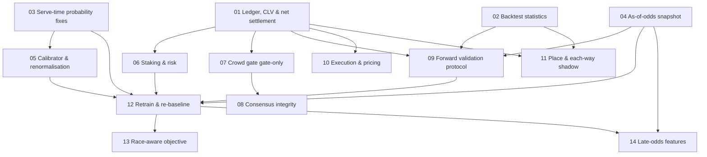

# STRIDE ROI Roadmap — implementation pack

Sequenced, evidence-backed fixes to maximise ROI and strike rate. Generated from a
full static audit of the pipeline; every task cites the code it changes and the
evidence that justifies it.

**If you are an AI coding agent (Kimi Code): read [`AGENTS.md`](AGENTS.md) first. It is your contract.**

**If you are a human:** read [`00-evidence-base.md`](00-evidence-base.md) (the audit),
then this page, then hand the pack to your coding agent.

## The one-paragraph truth

The model trains, validates, and backtests on closing SP but is served morning
prices — every headline number is flattered. The +12.3% ROI band is within noise
(95% CI ≈ [−44%, +68%], best-of-6 on one window, ≈+2–4% net of commission), and the
Top-Pick strike rate (33.7%) trails the SP favourite (34.4%) because market
information is triple-counted (features + anchor + consensus). So the program is:
**measure honestly → stop economic leaks → then retrain.** Reordering means tuning
against flattered metrics.

## Waves (execute in order)

| Wave | Theme | Tasks | Can parallelise? |
|------|-------|-------|------------------|
| 1 | Honest measurement & live-probability bugs | [01](01-ledger-clv-net-settlement.md) · [02](02-backtest-statistics.md) · [03](03-serve-time-probability-fixes.md) | Yes — 3 branches |
| 2 | Data capture & economics | [04](04-as-of-odds-snapshot.md) · [05](05-calibrator-and-normalisation.md) · [06](06-staking-and-risk-controls.md) · [07](07-crowd-gate-gate-only.md) | Yes — 4 branches |
| 3 | Signal integrity & validation protocol | [08](08-consensus-integrity.md) · [09](09-forward-validation-protocol.md) · [10](10-execution-and-pricing.md) · [11](11-place-and-each-way.md) | Yes — 4 branches |
| 4 | Retrain & model quality (after ≥4–6 weeks of 04 data) | [12](12-retrain-rebaseline.md) · [13](13-race-aware-objective.md) · [14](14-late-odds-features.md) | 12 → {13, 14} |

## Dependency graph

**Time-critical:** start `04` (odds snapshot capture) in Wave 2 even if other tasks
aren't finished — it captures data prospectively and Wave 4 is blocked on 4–6 weeks
of accumulation. Every day delayed is a day added to the retrain date.

## Task index

| # | File | Type | Risk | Expected effect |
|---|------|------|------|-----------------|
| 01 | [Ledger, CLV & net settlement](01-ledger-clv-net-settlement.md) | plumbing | low | Truth serum: CLV significance in ~400 bets |
| 02 | [Backtest statistics](02-backtest-statistics.md) | plumbing | low | No more noise headlines |
| 03 | [Serve-time probability fixes](03-serve-time-probability-fixes.md) | bugfix | low | Live probs match trained semantics |
| 04 | [As-of-odds snapshot](04-as-of-odds-snapshot.md) | data | low | Unblocks honest retrain |
| 05 | [Calibrator & renormalisation](05-calibrator-and-normalisation.md) | bugfix | med | Edges computed on real probabilities |
| 06 | [Staking & risk controls](06-staking-and-risk-controls.md) | economics | med | Survive the 30-bet losing streak |
| 07 | [Crowd gate: gate-only](07-crowd-gate-gate-only.md) | economics | low | No unmeasured forced bets |
| 08 | [Consensus integrity](08-consensus-integrity.md) | signal | med | De-correlated, auditable crowd score |
| 09 | [Forward validation protocol](09-forward-validation-protocol.md) | governance | low | Pre-registered, selection-bias-proof |
| 10 | [Execution & pricing](10-execution-and-pricing.md) | economics | low | Free ROI: better prices, honest fair prob |
| 11 | [Place & each-way](11-place-and-each-way.md) | product | med | ~3× strike rate path |
| 12 | [Retrain & re-baseline](12-retrain-rebaseline.md) | model | high | Honest metrics + learned ensemble |
| 13 | [Race-aware objective](13-race-aware-objective.md) | model | med | Direct top-pick strike-rate lever |
| 14 | [Late-odds features](14-late-odds-features.md) | model | med | Largest documented feature gain |

## Progress tracker (updated by the implementing PR)

| Task | Status | Date | Evidence link |
|------|--------|------|---------------|
| 01 | 🟡 | 2026-07-27 | `roi/01-ledger-clv-net-settlement` |
| 02 | ⬜ | | |
| 03 | ⬜ | | |
| 04 | 🟡 | 2026-07-27 | branch `roi/04-as-of-odds-snapshot` (migration `migrations/runner_odds_snapshots.sql`; capture live, coverage pending 3 race days) |
| 05 | ⬜ | | |
| 06 | ⬜ | | |
| 07 | ⬜ | | |
| 08 | ⬜ | | |
| 09 | ⬜ | | |
| 10 | ⬜ | | |
| 11 | ⬜ | | |
| 12 | ⬜ | | |
| 13 | ⬜ | | |
| 14 | ⬜ | | |
